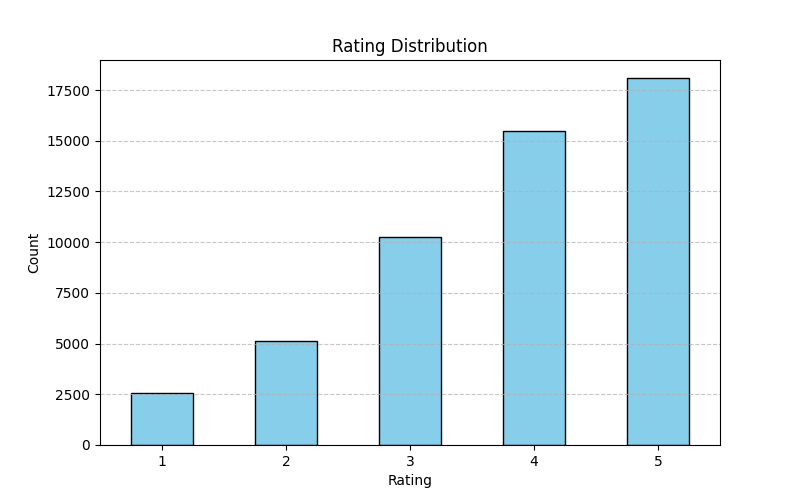
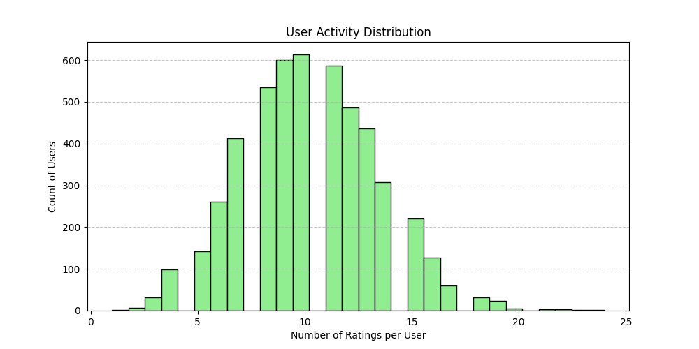
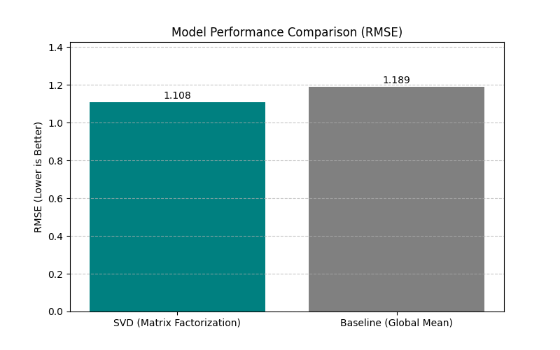

# Sleep Quality Improvement Recommendation Engine

## 1. Project Overview
This project focuses on building an **Intelligent Recommender System** to suggest sleep quality improvement products and applications. By analyzing user profiles, sleep habits, and product features, the system recommends personalized solutions such as sleep tracking apps, meditation guides, and smart sleep devices.

The goal is to leverage machine learning techniques including **Content-Based Filtering**, **Collaborative Filtering**, and a **Hybrid Approach** to enhance user well-being through better sleep.

## 2. Dataset Description
The project uses a synthetic dataset comprising three main components:

- **Users (`users.csv`)**: Contains profiles of **5,000 users**.
    - Attributes include: `user_id`, `age`, `gender`, `primary_sleep_issue`, `stress_level`, `sleep_schedule`, `caffeine_intake`, and more.
- **Items (`items.csv`)**: Contains details of **520 sleep-related products/apps**.
    - Attributes include: `item_id`, `name` (e.g., "Dream Track v1"), `category` (e.g., Mobile Apps), `description`, `features_json`, and `average_rating`.
- **Ratings (`ratings.csv`)**: Contains **51,488 interactions** between users and items.
    - Attributes include: `rating_id`, `user_id`, `item_id`, `rating` (1-5 scale), and `date`.

## 3. Methodology

### 3.1 Data Preprocessing & EDA
Located in `code/Data_preprocessing.ipynb` and embedded in `code/Collaborative Filtering & Hybrid Approach .ipynb`.

- **EDA**: Visualizing distributions to understand data characteristics.
    - **Rating Distribution**: Shows that ratings are skewed towards higher values (4-5), typical for product reviews.
    - **User Activity**: Most users have rated a small number of items.
    - **Item Popularity**: A few "blockbuster" items have many ratings, while most have few (long-tail).

  
  

### 3.2 Content-Based Filtering
Located in `code/Content_based.ipynb`.
- **Technique**: TF-IDF on item descriptions + Cosine Similarity.
- **User Profiles**: Aggregated vectors of liked items.

### 3.3 Collaborative Filtering
Located in `code/Collaborative Filtering & Hybrid Approach .ipynb`.
- **Matrix Factorization (SVD)**: Decomposes the user-item matrix ($R \approx U \Sigma V^T$) to predict missing ratings.
- **Model Comparison**: We evaluated the performance of SVD against a Baseline (Global Mean) using RMSE on a test sample.
    - **SVD RMSE**: ~1.108
    - **Baseline RMSE**: ~1.189
    - **Conclusion**: SVD outperforms the simple baseline, demonstrating that latent factors capture meaningful user preferences.

### 3.4 Hybrid Approach
Located in `code/Collaborative Filtering & Hybrid Approach .ipynb`.
- **Technique**: Weighted combination of normalized Content-Based and SVD scores.
- **Formula**: $Score = \alpha \cdot Score_{CB} + (1-\alpha) \cdot Score_{CF}$
- **Justification**: Combines the specificity of content features (good for niche needs) with the serendipity of collaborative filtering (good for discovering quality items).

## 4. How to Run
1.  **Prerequisites**: Ensure Python 3.x and necessary libraries (`pandas`, `numpy`, `scikit-learn`, `matplotlib`, `seaborn`) are installed.
2.  **Order of Execution**:
    1.  Run `Data_preprocessing.ipynb`.
    2.  Run `Content_based.ipynb`.
    3.  Run `Collaborative Filtering & Hybrid Approach .ipynb` for the recommender logic.
    4.  Run `Section2_Visualizations.py` to generate the plots shown above.

## 5. Results
- The system successfully identifies relevant sleep aids for users based on their specific sleep issues.
- **Visualizations**: Added comprehensive plots for data distribution and model evaluation.
- **Performance**: SVD provides better rating predictions than the baseline, and the Hybrid model leverages this to offer robust recommendations.